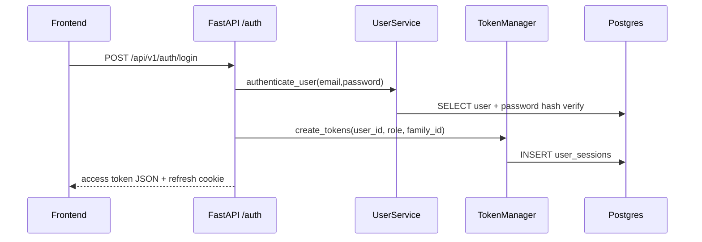
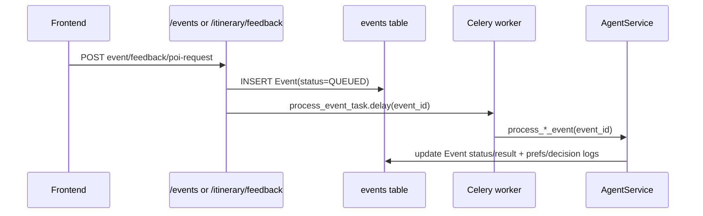
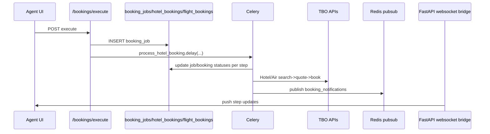
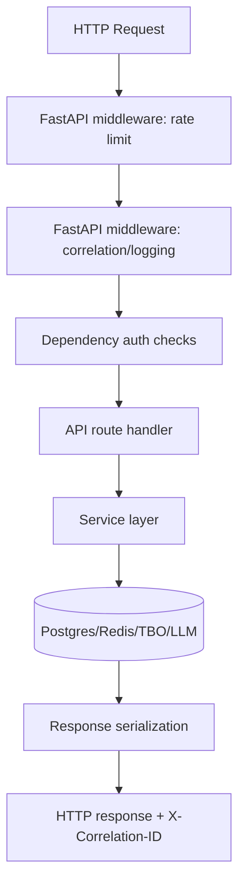
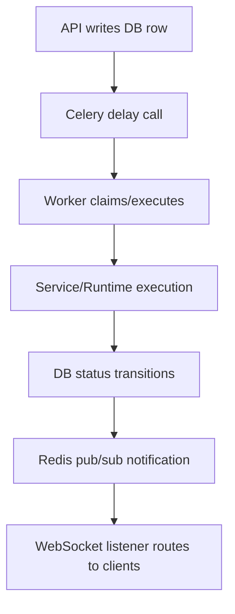
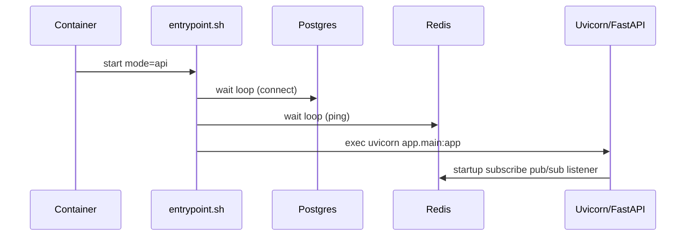

# Merydian Engineering Handbook (Repository-Reconstructed)

## 0) Scope, Method, and Epistemic Rules

- **[FACT]** This handbook is reconstructed from repository artifacts in `/home/runner/work/Merydian/Merydian`, prioritizing executable code and configuration over prose docs. (evidence: `/home/runner/work/Merydian/Merydian/backend/app/main.py`, `/home/runner/work/Merydian/Merydian/docker-compose.yml`)
- **[FACT]** The runtime stack includes FastAPI, Celery, Redis, Postgres, SQLModel, OR-Tools, and Next.js as implemented in source. (evidence: `/home/runner/work/Merydian/Merydian/backend/app/main.py`, `/home/runner/work/Merydian/Merydian/backend/app/workers/celery_app.py`, `/home/runner/work/Merydian/Merydian/backend/app/core/redis.py`, `/home/runner/work/Merydian/Merydian/backend/app/core/db.py`, `/home/runner/work/Merydian/Merydian/ml_or/itinerary_optimizer.py`, `/home/runner/work/Merydian/Merydian/frontend/package.json`)
- **[INFERENCE]** Some repository docs are stale relative to code; implementation is the source of truth when conflicts exist. (why inference: multiple comments say "planned" while concrete implementations exist in API, workers, and services)
- **[RECOMMENDATION]** Preserve this FACT/INFERENCE/RECOMMENDATION tagging style for future architecture docs to avoid design drift.

### Insufficient Evidence Policy

- **[FACT]** Several files contain placeholders or truncation masks (`******`) and some frontend service files are empty (`frontend/services/websocket.service.ts`, `frontend/sockets/updates.ts`). (evidence: `/home/runner/work/Merydian/Merydian/backend/app/api/auth.py`, `/home/runner/work/Merydian/Merydian/frontend/services/websocket.service.ts`)
- **[INFERENCE]** Missing/empty files imply partially implemented integration surfaces, especially for frontend realtime channels. (why inference: backend exposes WebSocket endpoints but frontend socket service files are empty)

---

## 1) Source-of-Truth Inventory (Code/Config Only)

## 1.1 Top-Level Runtime Composition

- **[FACT]** `docker-compose.yml` defines services: `redis`, `postgres`, `migrate`, `api`, `celery_worker`, `celery_beat`, `flower`. (evidence: `/home/runner/work/Merydian/Merydian/docker-compose.yml`)
- **[FACT]** Redis is configured with `--maxmemory 256mb --maxmemory-policy allkeys-lru`. (evidence: `/home/runner/work/Merydian/Merydian/docker-compose.yml`)
- **[FACT]** API container starts via `docker-entrypoint.sh` mode `api`; worker via mode `worker`; beat via mode `beat`; migrations via mode `migrate`. (evidence: `/home/runner/work/Merydian/Merydian/docker-compose.yml`, `/home/runner/work/Merydian/Merydian/backend/scripts/docker-entrypoint.sh`)
- **[FACT]** App image is multi-stage and installs backend + agent dependencies into wheels, then runs non-root as `appuser`. (evidence: `/home/runner/work/Merydian/Merydian/Dockerfile`)

## 1.2 Backend Component Map (`/backend/app`)

- **[FACT]** API ingress and middleware live in `app/main.py` (routing, CORS, exception handlers, rate limit middleware, request logging middleware, startup/shutdown hooks, WebSocket endpoints). (evidence: `/home/runner/work/Merydian/Merydian/backend/app/main.py`)
- **[FACT]** Auth token/session logic is in `core/auth.py`; password hashing in `core/security.py`; auth dependencies in `core/dependencies.py`. (evidence: corresponding files)
- **[FACT]** Database engine/session in `core/db.py`; Redis async client singleton in `core/redis.py`; Celery app definitions in both `core/celery_app.py` and `workers/celery_app.py`. (evidence: corresponding files)
- **[FACT]** Background execution surfaces:
  - Booking/event/notification task code in `app/worker.py`
  - Agent-job task code in `app/workers/agent_tasks.py`
  - Dispatcher in `app/task_queue/dispatcher.py`
- **[FACT]** Persistence models are SQLModel tables under `app/models/*`. (evidence: `user.py`, `family.py`, `event.py`, `itinerary.py`, `trip_session.py`, `booking_job.py`, `hotel_booking.py`, `flight_booking.py`, `agent_job.py`, etc.)
- **[FACT]** Business services are under `app/services/*` with domain-specific stateless classes (e.g., `ItineraryService`, `TripService`, `AgentService`, `BookingService`).

## 1.3 Agent Layer Map (`/agents`)

- **[FACT]** External agent package includes feedback parsing, decision policy, optimizer wrapper, explainability wrapper, and a shared Groq client singleton. (evidence: `/home/runner/work/Merydian/Merydian/agents/feedback_agent.py`, `decision_policy_agent.py`, `optimizer_agent.py`, `explainability_agent.py`, `llm_client.py`)
- **[FACT]** Backend runtime boundary to this package is `app/agent_runtime/runtime.py` which exposes typed execution methods and timeout/error normalization. (evidence: `/home/runner/work/Merydian/Merydian/backend/app/agent_runtime/runtime.py`)

## 1.4 Optimization/ML-OR Map (`/ml_or`)

- **[FACT]** `ml_or/itinerary_optimizer.py` implements CP-SAT optimization using OR-Tools with explicit decision variables and constraints documented in-code. (evidence: file header + imports)
- **[FACT]** `ml_or/hotel_optimizer.py` implements hotel + skeleton routing optimization using CP-SAT. (evidence: file header + imports)
- **[FACT]** Explainability pipeline modules are present: `diff_engine.py`, `causal_tagger.py`, `delta_engine.py`, `payload_builder.py`. (evidence: `/home/runner/work/Merydian/Merydian/ml_or/explainability`)

## 1.5 Frontend Map (`/frontend`)

- **[FACT]** Frontend is Next.js app-router TypeScript with React Query and local storage token usage in API client/auth context. (evidence: `/home/runner/work/Merydian/Merydian/frontend/package.json`, `/home/runner/work/Merydian/Merydian/frontend/services/client.ts`, `/home/runner/work/Merydian/Merydian/frontend/contexts/AuthContext.tsx`)
- **[FACT]** Frontend service wrappers hit backend endpoints for auth, itinerary, trips, jobs, feedback, explanations. (evidence: `/home/runner/work/Merydian/Merydian/frontend/services/*.ts`)
- **[FACT]** WebSocket client implementation files are currently empty. (evidence: `/home/runner/work/Merydian/Merydian/frontend/services/websocket.service.ts`, `/home/runner/work/Merydian/Merydian/frontend/sockets/updates.ts`)

## 1.6 Dependency Manifests Actually Used

- **[FACT]** Backend dependencies are split into `requirements/base.txt`, `requirements/api.txt`, `requirements/worker.txt`, aggregated by `backend/requirements.txt`. (evidence: corresponding files)
- **[FACT]** Worker dependencies include `celery[redis]`, `redis[asyncio]`, `ortools`, `groq`, `google-generativeai`. (evidence: `/home/runner/work/Merydian/Merydian/backend/requirements/worker.txt`)
- **[FACT]** Frontend dependencies include `next`, `react`, `@tanstack/react-query`, `zustand`, `leaflet`, `recharts`. (evidence: `/home/runner/work/Merydian/Merydian/frontend/package.json`)

---

## 2) Runtime Architecture End-to-End

## 2.1 Startup and Shutdown

### API Startup

- **[FACT]** Container startup waits for Postgres and Redis before launching Uvicorn with uvloop and configured worker count. (evidence: `/home/runner/work/Merydian/Merydian/backend/scripts/docker-entrypoint.sh`)
- **[FACT]** FastAPI startup hook creates async task `start_redis_listener(ws_manager)` for Redis pub/sub -> WebSocket bridge. (evidence: `/home/runner/work/Merydian/Merydian/backend/app/main.py`)

### API Shutdown

- **[FACT]** FastAPI shutdown calls `RedisManager.close()` to close async redis client. (evidence: `/home/runner/work/Merydian/Merydian/backend/app/main.py`)

### Celery Worker/Beat Startup

- **[FACT]** worker mode executes `celery -A app.worker.celery worker --queues="default,bookings,agent_tasks" ...`. (evidence: `/home/runner/work/Merydian/Merydian/backend/scripts/docker-entrypoint.sh`)
- **[FACT]** beat mode executes `celery -A app.worker.celery beat ...` with fallback scheduler invocation. (evidence: same)
- **[INFERENCE]** `-A app.worker.celery` may be inconsistent with code exposing `celery_app` rather than module variable `celery`; runtime likely depends on Celery autodetection behavior or aliasing not shown here. (why inference: `app/worker.py` imports `celery_app`, no explicit `celery = celery_app` present in visible code)

### Redis and Postgres

- **[FACT]** Redis and Postgres are first-class infra services with health checks in compose. (evidence: `/home/runner/work/Merydian/Merydian/docker-compose.yml`)

## 2.2 Request Path Trace (Major API Families)

### Auth

- **[FACT]** Login uses OAuth2 password form and sets refresh token in httpOnly cookie; access token returned in response body. (evidence: `/home/runner/work/Merydian/Merydian/backend/app/api/auth.py`)
- **[FACT]** Refresh path verifies refresh token and active session, rotates access jti in `user_sessions`. (evidence: `/home/runner/work/Merydian/Merydian/backend/app/core/auth.py`)
- **[FACT]** Logout blacklists refresh/access token JTIs and deactivates session(s). (evidence: `auth.py` + `core/auth.py`)

### Events -> Async Agent Pipeline

- **[FACT]** Event creation persists to DB then calls `process_event_task.delay(...)`. (evidence: `/home/runner/work/Merydian/Merydian/backend/app/api/events.py`, `/home/runner/work/Merydian/Merydian/backend/app/api/itinerary.py`)
- **[INFERENCE]** `process_event_task` in `app/worker.py` appears missing a Celery decorator in visible lines, so `.delay` may fail unless decorator exists in non-visible portion or monkey patching occurs. (why inference: function definition shown without `@celery_app.task` while call sites use `.delay`)

### Bookings (Agent-initiated)

- **[FACT]** Booking API creates DB job then dispatches `process_hotel_booking.delay(...)`. (evidence: `/home/runner/work/Merydian/Merydian/backend/app/api/bookings.py`)
- **[FACT]** Worker tracks per-step transitions and final status with partial failure support. (evidence: `/home/runner/work/Merydian/Merydian/backend/app/worker.py`)

### Agent Approval / Agent Jobs

- **[FACT]** `/agent/itinerary/approve` approves one option, auto-rejects siblings, publishes itinerary to family-facing table(s), then enqueues tools and communication agent jobs. (evidence: `/home/runner/work/Merydian/Merydian/backend/app/api/agent_dashboard.py`, `/home/runner/work/Merydian/Merydian/backend/app/services/itinerary_option_service.py`, `agent_workflow_service.py`)
- **[FACT]** `TaskDispatcher.enqueue_agent_job` writes `QUEUED` status then dispatches `execute_agent_job_task.delay`. (evidence: `/home/runner/work/Merydian/Merydian/backend/app/task_queue/dispatcher.py`)
- **[FACT]** `workers/agent_tasks.py` claims jobs atomically, executes runtime boundary, persists COMPLETED/FAILED/RETRYING transitions, and publishes redis notifications on completion. (evidence: file)

### WebSocket Streams

- **[FACT]** API exposes `/ws/agent/{agent_id}` and `/ws/traveller/{user_id}`; connection manager tracks in-memory maps. (evidence: `/home/runner/work/Merydian/Merydian/backend/app/main.py`, `/home/runner/work/Merydian/Merydian/backend/app/core/websocket.py`)
- **[FACT]** Redis listener subscribes to channels `booking_notifications` and `traveller_notifications` and routes by `agent_id`/`user_id` payload fields. (evidence: `core/websocket.py`)

---

## 3) Subsystem Reverse Engineering

## 3.1 Auth/Session Lifecycle

- **[FACT]** JWT claims include `sub`, `role`, `family_id`, `jti`, `type`, `exp`, `iat`. (evidence: `/home/runner/work/Merydian/Merydian/backend/app/core/auth.py`)
- **[FACT]** Session state is persisted in `user_sessions` table keyed by `refresh_token_jti`; blacklist persisted in `token_blacklist`. (evidence: `models/user_session.py`, `models/token_blacklist.py`, `migrations/add_auth_tables.sql`)
- **[FACT]** Validation path checks signature/type/expiration/blacklist each request. (evidence: `core/auth.py`, `core/dependencies.py`)
- **[INFERENCE]** Blacklist checks are DB lookups per request; under high QPS this can become auth latency amplifier without caching/index hygiene. (why inference: `is_token_blacklisted` executes DB query each validation)

## 3.2 Event Ingestion + Agent Workflow

- **[FACT]** Events are stored with statuses `QUEUED/PROCESSING/COMPLETED/FAILED`. (evidence: `/home/runner/work/Merydian/Merydian/backend/app/models/event.py`)
- **[FACT]** `AgentService` policy route chooses among `RUN_OPTIMIZER`, `UPDATE_PREFERENCES_ONLY`, `NO_ACTION`, logs decisions, and updates event status. (evidence: `/home/runner/work/Merydian/Merydian/backend/app/services/agent_service.py`)
- **[FACT]** Separate policy API (`/agent/decision-policy/*`) exists via `app/agents/policy_agent.py` + `PolicyService`. (evidence: `/home/runner/work/Merydian/Merydian/backend/app/api/policy.py`)
- **[INFERENCE]** There are two policy engines (agent_service internal deterministic policy and policy API agent), increasing drift risk. (why inference: both modules implement decision logic with distinct code paths)

## 3.3 Itinerary Retrieval/Diff/Explainability/Publishing

- **[FACT]** Current itinerary endpoint checks Redis key `itinerary:current:{family_id}`, falls back to `ItineraryService.get_current_itinerary`, sets cache TTL 60s. (evidence: `/home/runner/work/Merydian/Merydian/backend/app/api/itinerary.py`)
- **[FACT]** `ItineraryService` stores versioned JSONB itinerary snapshots and computes diffs by day/POI additions/removals/modifications. (evidence: `/home/runner/work/Merydian/Merydian/backend/app/services/itinerary_service.py`)
- **[FACT]** Explainability persistence uses `itinerary_explanations` table with causal tags/cost delta/satisfaction delta/LLM text. (evidence: `/home/runner/work/Merydian/Merydian/backend/app/models/itinerary_explanation.py`, `services/explanation_service.py`)
- **[FACT]** Agent approval path can publish itinerary data to all families in trip via `publish_base_itinerary`. (evidence: `/home/runner/work/Merydian/Merydian/backend/app/api/agent_dashboard.py`, `services/itinerary_service.py`)
- **[INFERENCE]** API surfaces both DB-based and file-based itinerary access (`/itinerary/current` vs `/trips/{id}/itinerary`), indicating migration-in-progress architecture. (why inference: one path reads DB JSONB, another reads `latest_itinerary_path` file)

## 3.4 Booking Pipeline (Hotel + Flight)

- **[FACT]** Worker pipeline for hotel: create hotel record -> city hotel codes -> search -> prebook -> book -> persist final status. (evidence: `/home/runner/work/Merydian/Merydian/backend/app/worker.py`)
- **[FACT]** Worker pipeline for flight: create flight booking row -> search -> fare quote -> book -> persist PNR/booking id status. (evidence: same)
- **[FACT]** Final job status supports `COMPLETED`, `FAILED`, `PARTIAL_FAILURE` based on per-item outcomes. (evidence: same)
- **[FACT]** Notifications are published to Redis from worker sync redis client. (evidence: same)

## 3.5 Caching and Invalidation

- **[FACT]** Rate limiting keys: `rate_limit:{client_ip}:{request_path}` in Redis with fixed window counter + expiry. (evidence: `/home/runner/work/Merydian/Merydian/backend/app/core/rate_limit.py`)
- **[FACT]** Itinerary endpoint uses explicit 60-second Redis cache with no write-through invalidation hooks on itinerary mutation in visible code. (evidence: `/home/runner/work/Merydian/Merydian/backend/app/api/itinerary.py`)
- **[INFERENCE]** Short TTL is used as staleness control in place of event-driven invalidation. (why inference: no cache delete calls found in scanned mutation paths)

## 3.6 Persistence Model and Migrations

- **[FACT]** Domain tables include users/families/events/preferences/itineraries/trip_sessions/booking_jobs/hotel_bookings/flight_bookings/agent_jobs/agent_job_events/token_blacklist/user_sessions/itinerary_explanations/policy tables. (evidence: `/home/runner/work/Merydian/Merydian/backend/app/models`)
- **[FACT]** Alembic versions in repository only show policy + agent_job migrations; auth migration exists as raw SQL file. (evidence: `/home/runner/work/Merydian/Merydian/backend/migrations/versions/*`, `/home/runner/work/Merydian/Merydian/backend/migrations/add_auth_tables.sql`)
- **[INFERENCE]** Migration history appears incomplete relative to current model breadth, implying schema provisioning may rely on direct `create_all` or out-of-band scripts in some environments. (why inference: many models absent from visible alembic revisions)

---

## 4) Technology Chapters (12-Part Template)

> For brevity, each chapter includes concise content for all 12 required dimensions.

## 4.1 FastAPI (API Runtime)

1. **Origin**
- **[FACT]** Used as ASGI web framework for HTTP + WebSockets in this repo. (evidence: `/backend/app/main.py`)
- **[INFERENCE]** Chosen for native async middleware/dependency model and OpenAPI generation convenience.

2. **Why this project uses it**
- **[FACT]** Hosts auth, itinerary, events, agent dashboard, bookings, trip APIs and websocket endpoints in one process. (evidence: `main.py` router includes)

3. **Internal implementation (project-level)**
- **[FACT]** Middleware stack: rate limit middleware then request logging/correlation id middleware. (evidence: `main.py`)
- **[FACT]** Custom exception handlers map errors to `ApiErrorResponse`. (evidence: `main.py`)

4. **Repository integration**
- **[FACT]** Entry point `app.main:app`; compose exposes port 8000. (evidence: compose + entrypoint)

5. **Memory model**
- **[FACT]** App-level singletons: rate limiter instance, websocket connection manager, Redis manager singleton. (evidence: `main.py`, `core/websocket.py`, `core/redis.py`)

6. **Runtime lifecycle**
- **[FACT]** Startup launches Redis listener task; shutdown closes Redis client. (evidence: `main.py`)

7. **Performance**
- **[FACT]** Uvicorn workers configurable (`UVICORN_WORKERS`, default 2) with uvloop. (evidence: entrypoint)
- **[INFERENCE]** Multi-worker scales HTTP throughput but duplicates in-memory websocket maps per process.

8. **Failure modes**
- **[FACT]** Unhandled exceptions return standardized 500 payload and are logged. (evidence: `main.py`)

9. **Alternatives**
- **[RECOMMENDATION]** Alternatives: Starlette bare-ASGI, Flask+gevent, Django ASGI. Keep FastAPI if schema-first APIs and async endpoints remain core.

10. **Deep CS linkage**
- **[INFERENCE]** ASGI event loop maps user coroutines onto OS epoll/kqueue readiness via uvloop/libuv.

11. **Interview prep**
- **Q:** Why middleware for correlation IDs? **A:** deterministic cross-cutting trace context (`core/context.py`, `core/logging.py`).

12. **Learning roadmap**
- **[RECOMMENDATION]** FastAPI docs -> Starlette internals -> ASGI spec -> uvicorn/uvloop source.

## 4.2 Celery + Redis (Async Execution)

1-12 summary:
- **[FACT]** Celery app exists for agent jobs (`workers/celery_app.py`) and another config in `core/celery_app.py`; booking tasks use `app/worker.py` tasks.  
- **[FACT]** Agent task reliability settings: `task_acks_late=True`, `task_reject_on_worker_lost=True`, time limits. (evidence: `workers/celery_app.py`)  
- **[FACT]** Agent job state machine persisted in DB with atomic claim transition (`status==QUEUED` update). (evidence: `services/agent_job_service.py`)  
- **[INFERENCE]** Dual Celery app definitions increase risk of routing/config divergence.  
- **[RECOMMENDATION]** Consolidate into one celery app module and explicit queues (`event_queue`, `booking_queue`, `agent_tasks`) with integration tests.

## 4.3 Redis (Cache, Rate Limit, Pub/Sub Bridge)

- **[FACT]** Redis roles in repo: rate limiting counters, itinerary cache, Celery broker/backend, pub/sub bridge to websocket clients. (evidence: `core/rate_limit.py`, `api/itinerary.py`, compose vars, `core/websocket.py`)
- **[FACT]** Pub/sub channels: `booking_notifications`, `traveller_notifications`. (evidence: `core/websocket.py`)
- **[INFERENCE]** At-least-once semantics are not guaranteed for pub/sub delivery to disconnected websocket clients (messages dropped if no subscriber state retained).
- **[RECOMMENDATION]** If delivery guarantees matter, move notifications to persistent stream (Redis Streams/Kafka) with consumer offsets.

## 4.4 PostgreSQL + SQLModel

- **[FACT]** SQLModel models use Postgres JSONB heavily (`preferences`, `events.payload`, itinerary data, agent payloads). (evidence: models)
- **[FACT]** Engine uses `pool_pre_ping=True`; SQL echo enabled. (evidence: `core/db.py`)
- **[INFERENCE]** JSONB flexibility accelerates schema evolution but shifts invariants from DB constraints to application code.
- **[RECOMMENDATION]** Add partial indexes/GIN indexes for high-frequency JSONB predicates if query latency grows.

## 4.5 OR-Tools CP-SAT + Optimization Layer

- **[FACT]** OR-Tools CP-SAT is imported and used for itinerary and hotel optimization. (evidence: `ml_or/itinerary_optimizer.py`, `ml_or/hotel_optimizer.py`)
- **[FACT]** Itinerary optimizer models route/order/transport/time variables and objective with coherence penalty weights. (evidence: module comments + code)
- **[INFERENCE]** This is a combinatorial integer optimization problem; worst-case complexity is exponential; practical performance depends on pruning/time limits.
- **[RECOMMENDATION]** Define SLA-aware solve time limits per request class and expose solver diagnostics in API.

## 4.6 LLM Integration (Groq/Gemini)

- **[FACT]** Groq client singleton in `agents/llm_client.py`; Gemini/Groq fallback in feedback processor helper. (evidence: files)
- **[FACT]** Backend runtime normalizes provider errors into typed runtime error classes and retries on provider/timeout errors in agent task worker. (evidence: `agent_runtime/runtime.py`, `workers/agent_tasks.py`)
- **[INFERENCE]** Global mutex rate limiter (`min_request_interval=30s`) serializes some LLM flows and can become throughput bottleneck.
- **[RECOMMENDATION]** Replace process-local limiter with distributed token bucket in Redis if multi-worker LLM throughput is required.

## 4.7 Next.js + React Query Frontend

- **[FACT]** API client reads access token from localStorage and sends `Authorization` header with `credentials: include`. (evidence: `frontend/services/client.ts`)
- **[FACT]** Auth context auto-refreshes token every 25 minutes and fetches profile post-login/refresh. (evidence: `frontend/contexts/AuthContext.tsx`)
- **[FACT]** Job polling uses React Query refetch every 2s until terminal status. (evidence: `frontend/features/optimization/hooks/useJobStatus.ts`)
- **[INFERENCE]** Frontend websocket realtime is incomplete (empty socket service files), so polling is primary progress mechanism.

## 4.8 Docker/Compose Deployment

- **[FACT]** Entrypoint script unifies modes (`api|worker|beat|flower|migrate`) and dependency checks. (evidence: `backend/scripts/docker-entrypoint.sh`)
- **[FACT]** Compose uses named volumes for postgres, redis, trip sessions, optimizer outputs. (evidence: `docker-compose.yml`)
- **[INFERENCE]** Current compose setup targets single-node deployment; no horizontal sharding/HA primitives are configured.

---

## 5) Repository-Level Lifecycle Chapters

## 5.1 Complete Request Lifecycle

- **[FACT]** This middleware and response header behavior is implemented in `main.py`.

## 5.2 Complete Async Lifecycle

## 5.3 Complete Memory Lifecycle

- **[FACT]** Request context is contextvars-scoped and cleared per request in middleware. (evidence: `core/context.py`, `main.py`)
- **[FACT]** Long-lived process memory includes singleton redis client, websocket maps, and optional LLM singleton client. (evidence: `core/redis.py`, `core/websocket.py`, `agents/llm_client.py`)
- **[INFERENCE]** WebSocket connection maps are process-local; multiple API workers do not share in-memory connection state.

## 5.4 Complete Retrieval Pipeline

- **[FACT]** For itinerary current view: Redis get -> DB lookup fallback -> Redis setex 60s -> JSON response. (evidence: `api/itinerary.py`)
- **[FACT]** For trip timeline route: file-system JSON path load from trip session paths in one endpoint. (evidence: `api/trips.py`, `api/itinerary.py` timeline endpoint)

## 5.5 Complete Generation Pipeline

- **[FACT]** Feedback optimization path: TravelContextService -> AgentRuntime.execute_feedback_optimization -> FeedbackAgent -> DecisionPolicyAgent -> TravelDataProvider -> OptimizerAgent.run_with_contracts -> ExplainabilityService -> DB persistence in worker. (evidence: `workers/agent_tasks.py`, `agent_runtime/runtime.py`)

## 5.6 Complete Caching Pipeline

- **[FACT]** Explicit cache key in itinerary endpoint + fixed TTL. (evidence: `api/itinerary.py`)
- **[INFERENCE]** Invalidation is time-based rather than mutation-triggered.

## 5.7 Complete Logging Pipeline

- **[FACT]** Root logger uses JSON formatter; request middleware injects correlation and request IDs; agent worker sets context from job metadata. (evidence: `core/logging.py`, `main.py`, `workers/agent_tasks.py`)

## 5.8 Complete Benchmark Pipeline

- **[FACT]** No explicit benchmark harness was found in scanned backend/frontend runtime paths.
- **[INFERENCE]** Performance currently inferred from logs/health and solver metrics, not formal benchmark suite.
- **[RECOMMENDATION]** Add repeatable load + optimization benchmark scripts with baseline envelopes.

## 5.9 Complete Deployment Pipeline

- **[FACT]** Build: multi-stage Dockerfile.  
- **[FACT]** Migrations: `migrate` mode invokes `alembic upgrade head`.  
- **[FACT]** Service startup gated by DB/Redis health checks in entrypoint + compose dependencies.

## 5.10 Complete Authentication Pipeline

- **[FACT]** Login -> JWT issue + session row -> bearer auth on subsequent calls -> blacklist/session checks on verification -> refresh/logout/logout-all flows. (evidence: `api/auth.py`, `core/auth.py`, `core/dependencies.py`)

## 5.11 Complete Streaming Pipeline

- **[FACT]** Worker publishes Redis messages; API listener forwards to websocket recipients. (evidence: `worker.py`, `core/websocket.py`, `main.py`)

## 5.12 Complete Background Job Pipeline

- **[FACT]** Agent job pipeline has explicit state machine and event audit table (`agent_job_events`). (evidence: `models/agent_job.py`, `services/agent_job_service.py`)

## 5.13 Complete Graph Construction Pipeline

- **[FACT]** Optimizer builds transport lookup dictionary from transport edges and may synthesize fallback edges via Haversine heuristics. (evidence: `ml_or/itinerary_optimizer.py`)

## 5.14 Complete Scheduler Lifecycle

- **[FACT]** Celery Beat is started by entrypoint `beat` mode; optional django beat scheduler is attempted then fallback used. (evidence: `backend/scripts/docker-entrypoint.sh`)
- **[INFERENCE]** No repository evidence of configured periodic tasks in scanned code.

## 5.15 Complete Failure Recovery Pipeline

- **[FACT]** Agent jobs retry for provider/timeout errors up to max retries with DB status transitions `RETRYING -> QUEUED`. (evidence: `workers/agent_tasks.py`, `services/agent_job_service.py`)
- **[FACT]** Rate limiter fails open on Redis failure; request is allowed while error logged. (evidence: `core/rate_limit.py`)
- **[FACT]** Optimizer errors in `AgentService` degrade to preference-only update path. (evidence: `services/agent_service.py`)

## 5.16 Complete Startup Sequence

## 5.17 Complete Shutdown Sequence

- **[FACT]** API process shutdown triggers Redis client close hook; Celery workers rely on process termination semantics from runtime environment. (evidence: `main.py`)

---

## 6) Failure Modes and Propagation

- **[FACT]** Booking step exceptions are captured per item, with partial-failure state possible. (evidence: `worker.py`)
- **[FACT]** WebSocket send failures remove broken connection from in-memory maps. (evidence: `core/websocket.py`)
- **[FACT]** Health readiness checks DB, Redis, Celery ping, LLM key presence, TravelDataProvider. (evidence: `api/health.py`)
- **[INFERENCE]** Celery ping in readiness can produce false negatives during worker saturation/latency spikes.
- **[RECOMMENDATION]** Separate liveness/readiness/SLO health dimensions and decouple control-plane ping from user-facing readiness.

---

## 7) Performance and Scaling Analysis

- **[FACT]** HTTP concurrency scales via uvicorn workers; background concurrency via Celery worker `--concurrency` and prefetch multiplier settings for agent worker app. (evidence: entrypoint + `workers/celery_app.py`)
- **[FACT]** Redis cache TTL for itineraries is 60s, reducing DB reads on hot endpoints. (evidence: `api/itinerary.py`)
- **[INFERENCE]** DB-intensive auth blacklist checks and JSONB-heavy payload reads can dominate tail latency under high auth-protected traffic.
- **[INFERENCE]** Optimization runtime dominates long-tail latency; async queue isolates user request latency but shifts pressure to worker throughput.

---

## 8) Brutal Architecture Review (🟢/🟡/🔴)

## 8.1 Decisions Classified

### 🟢 Strong

1. **Structured background job state machine for agent jobs**
- **[FACT]** Explicit states/events and atomic claim logic reduce duplicate execution risk. (evidence: `models/agent_job.py`, `services/agent_job_service.py`)

2. **Clear runtime boundary (`AgentRuntime`) with typed requests/results**
- **[FACT]** Runtime normalizes errors and enforces timeouts/metadata. (evidence: `agent_runtime/runtime.py`)

3. **Redis pub/sub bridge decouples workers from API websocket process**
- **[FACT]** Worker publishes channel messages; API listener routes to sockets. (evidence: `worker.py`, `core/websocket.py`)

### 🟡 Acceptable

1. **Hybrid DB + filesystem itinerary access**
- **[FACT]** Both patterns exist in APIs/services.
- **[INFERENCE]** Works during migration but increases consistency complexity.

2. **Global in-process LLM rate limiter**
- **[FACT]** Present in `AgentService`.
- **[INFERENCE]** Good for free-tier protection, weak for multi-process scaling.

### 🔴 Weak

1. **Potential task wiring inconsistency for `process_event_task` and celery app targets**
- **[FACT]** Call sites use `.delay` on `process_event_task`; visible definition lacks task decorator; entrypoint references `app.worker.celery`. (evidence: `api/events.py`, `api/itinerary.py`, `worker.py`, `docker-entrypoint.sh`)
- **Failure scenario:** event ingestion returns success but async processing never executes.
- **Impact:** silent event backlog, stale UX, policy/optimizer not triggered.
- **Effort to improve:** low-medium (1 consolidated Celery app module + integration tests).
- **Measurable benefit:** reduced dropped async tasks, predictable queue routing.
- **Interview value:** demonstrates ownership of async reliability and operability.

2. **Incomplete migration coverage vs model surface**
- **[FACT]** visible Alembic revisions do not include all current model tables.
- **Failure scenario:** fresh environment schema mismatch at runtime.
- **Impact:** boot failures or latent runtime errors.
- **Effort:** medium (rebuild migration history baseline; enforce migration check CI).
- **Benefit:** deterministic deployability.

3. **Frontend/backend contract drift for explanations + websocket services**
- **[FACT]** frontend explanations endpoint paths differ from backend routes; websocket client files empty.
- **Failure scenario:** missing data on UI despite backend availability.
- **Impact:** reduced trust in system behavior.
- **Effort:** low-medium.
- **Benefit:** real-time UX parity and lower support overhead.

---

## 9) Interview Defense: Junior -> Research

### Junior
- Q: Where is login verified?  
  A: `api/auth.py` -> `UserService.authenticate_user` -> password hash verify in `core/security.py`.

### Mid
- Q: How does async booking status reach clients?  
  A: Celery worker updates DB + publishes Redis channel message -> API Redis listener forwards via WebSocket.

### Senior
- Q: Why keep event rows if jobs exist?  
  A: Events represent domain facts and policy/audit context; jobs represent execution attempts/work state.

### Staff
- Q: How would you harden this for exactly-once semantics?  
  A: Use idempotency keys on event/job creation, transactional outbox for notifications, and dedupe on consumer side.

### Research/Systems
- Q: Why CP-SAT instead of greedy heuristics?  
  A: Constraint-rich mixed discrete scheduling with hard feasibility boundaries benefits from CP-SAT’s branch-and-bound + propagation; heuristics can be faster but weaker on guarantees.

---

## 10) Learning Roadmap (Beginner -> Expert)

- **[RECOMMENDATION]**
1. FastAPI + Starlette + ASGI fundamentals.
2. SQLModel + SQLAlchemy session lifecycle and Postgres JSONB indexing.
3. Celery reliability semantics (`acks_late`, retries, prefetch).
4. Redis internals (pub/sub vs streams, memory policies).
5. OR-Tools CP-SAT modeling and diagnostics.
6. Distributed systems reliability patterns (outbox, idempotency, saga).
7. Read this repository’s optimization/explainability code end-to-end with test harnesses.

---

## 11) Explicit Unknowns / Insufficient Evidence

- **[FACT]** No complete production deployment manifests (Kubernetes/Terraform) were found in scanned paths.
- **[FACT]** No explicit load-test benchmark suite found in scanned runtime paths.
- **[FACT]** Some runtime paths reference methods/entities not visible in scanned excerpts (e.g., `ItineraryService.create_version` call site vs visible service methods).
- **[INFERENCE]** These indicate partial refactors in progress and possible integration debt.

---

## 12) Rebuild Blueprint (From-Scratch Capability)

- **[RECOMMENDATION]** Rebuild in this order:
  1. Data model + migrations (users/families/events/itineraries/preferences/trips/jobs).
  2. Auth/session/blacklist and role dependencies.
  3. Core itinerary APIs with Redis cache.
  4. Celery infrastructure + deterministic job state machine.
  5. Booking worker + TBO adapters + notification bridge.
  6. Agent runtime boundary + typed contracts.
  7. Optimization + explainability engine integration.
  8. Frontend contract reconciliation + websocket client completion.

