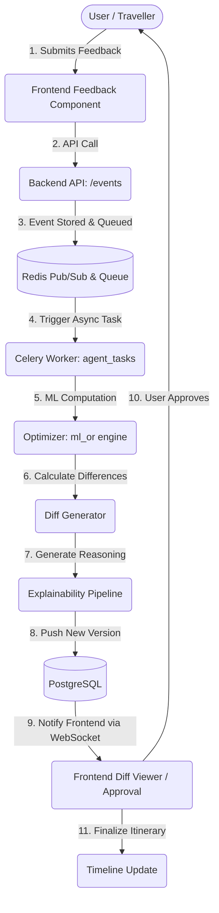

# Merydian Project Dataflow

## E2E Optimization and Feedback Loop

## Detailed Steps
1. **User**: Provides feedback (e.g., "We prefer a more relaxed pace", or "Add Taj Mahal to the trip").
2. **Feedback**: The `FeedbackPage.tsx` sends a structured request to the backend.
3. **Backend**: `event_service.py` receives the feedback, updates the `PreferenceHistory`, and publishes an event.
4. **Optimizer**: The Celery worker picks up the event, passes constraints to `itinerary_optimizer.py`.
5. **Diff**: The new solution is compared against the `current_itinerary_id` to generate structural diffs.
6. **Explainability**: `explainability_service.py` uses context to map diffs to human-readable explanations.
7. **Approval**: The user reviews the changes in `DiffViewerPage.tsx`.
8. **Timeline Update**: Upon approval, the new itinerary version becomes active, updating `TimelinePage.tsx` and pushing final updates via WebSockets.
